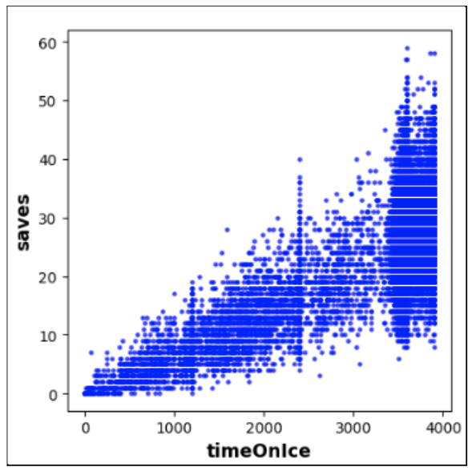

## Group 2 Project Midterm Report - NHL Playoff Predictor
Bryan Zhao, Karishma Sabnani, Timothy Bang, Gabrielle Germanson, Noah Wallace

### Introduction/Background

The National Hockey League was formed in 1917 and spans 32 teams across the United States and Canada. In an average season, each team will play a total of 82 regular season games which generates a plethora of performance metrics on teams and players [1]. An important indicator of a successful hockey team is if they are one of the 16 teams that play in the playoffs at the end of each season in April.

### Problem Definition

In the NHL, the winner of a game boils down to whichever team scores more goals. There are many factors that contribute to scoring a goal, ranging from total shots taken and face-offs won, to penalties and total saves [2]. The dataset chosen contains factors like these and more for all teams across seasons. The goal of this project is to predict the playoff rankings of the 16 teams that make it to the playoffs by the halfway point of the season.

### Data Collection

The dataset was sourced from Kaggle and consists of 9 different tables that track game-by-game, overall team, individual player, and other statistics across NHL seasons dating back to the 2000-01 season [3]. These tables were trimmed of non-numeric data as well as incomplete seasons including the 2004-05 and 2012-13 seasons which were shortened due to labor lockouts and the recent 2019-20 and 2020-21 seasons which were affected by COVID. Since the goal of this project is to predict playoff standings using only data from the first half of a season, data after the month of January was discarded. From there, the remaining data was combined into three tables organized by game-by-game, player, and goalie statistics. Also, for this midterm report, it is important to note that a smaller subset of features were selected for faster model development. In the final report, more features will be included. Figure 1 visualizes two features from goalie data, and Figure 2 visualizes two features from player data. 

|  | 
|:--:| 
| *Figure 1: Shows us the correlation between the time a goalie spent on ice and the amount of saves that make. The graphic makes sense. The longer the goalie is on ice, the more shots they are able to save.* |

|  | 
|:--:| 
| *Figure 2: The relationship between the penalty minutes and the number of shots a skater can take. Again, this figure seems logical. If a skater spends a lot of time sitting out in penalty, then they are not able to take as many shots as if they were on ice.* |

The game-by-game data is most relevant to the goal of this project, and it is what has been most utilized in the project so far. To transform the game-by-game data into a usable form for a model, the various metrics were summed for each team each season, resulting in summary statistics for every team in the first half of every season. Labels were manually procured from online by tabulating the standings of the top 16 teams for every season, and these labels were appended to the summary statistics table [5].

### Methods
As an initial step in building our first model, we made the decision to redefine our problem temporarily to a smaller scope. Instead of predicting which teams make the playoffs and their playoff rankings for a season, we predicted whether or not a team makes it to the playoffs that season. This allowed us to understand the logistic regression model better by utilizing it for its traditional binary classification instead of for multiclass classification: instead of classifying each team as a value from 0-16 (inclusive, 0 representing not making it to the playoffs), we classify each team as a binary value 0-1 based on the ideal threshold provided in the model.

The temporary change in our problem definition required altering the dataset as well. The team end-of-season rankings in the dataset (label to be predicted) were converted from values 0-16 to binary values. If a team has a playoff ranking (1-16), then the value becomes 1. Otherwise, it remains as a 0 value. Then, the dataset is split into 76% training and 34% testing datasets by season. Next, the training dataset is balanced through oversampling. The balanced training data has the same number of rows with 1 as the label value as rows with 0 as the label value. Balancing is beneficial regarding PCA and logistic regression accuracy. Lastly, both training and testing datasets are standardized to unitary scale.

For dimensionality reduction, we decided on implementing PCA with our project. Before doing anything with PCA, we had to make sure that we were only inputting numerical data. One of the first tasks was to make sure we were only reading the columns of that dataset that had numbers. The other important task to do before the actual PCA implementation was to find the correct number of components we wanted to reduce our dataset down to. There is a parameter for PCA method in the sklearn library that requests for the specific number of components we want to reduce to, so in order to find the exact number, we plotted the variance against the number of components.

|  | 
|:--:| 
| *Figure 3: When plotting the variance of the input against the number of components, we typically looked for a variance that was around 95%[4]. So, wherever it passes the threshold, is the number of components we should use for PCA.* |

After finding the correct number of components to reduce down to, we then moved towards implementing PCA on our datasets. As stated previously, with the help of the sklearn library, we were able to successfully implement PCA on our datasets. We were able to do so by simply inputting the number of components we had found earlier for a given dataset. There is a check after PCA for any dimensions that have a p-value greater than or equal to .05. If there is such a dimension(s), it is removed since it is insignificant.

We used scikit-learn’s logistic regression to fit a linear model to the training dataset and labels. The linear model is then used on the testing dataset to output predicted testing labels regarding whether a team made it to the playoffs for a certain season. The binary classification threshold is determined through the outputs of the receiver operating characteristic curve (ROC) function in scikit-learn’s logistic regression implementation. With these predicted labels, multiple measures are used to evaluate accuracy. 

### Results and Discussion
After we finished implementing our PCA function, we ran it on each of the three sets of data. For our game data, PCA was able to reduce it from 8 features to 5 features. For our goalie data, it was able to reduce it from 7 features to 4 features and for our skater data, it was able to reduce it from 8 features to 5 features. This is an improvement, but we wanted a way to be able to visualize our data, so we decided to write a function for it. Since we are working with multi-dimensional data before and after PCA, we needed to come up with a good way to do it. We decided on plotting every possible combination of features in a two-dimensional scatterplot. Plotting every combination gave us some plots that were useless of course, but it was the best way to plot data without having to worry about feature selection. Scatterplots proved to be the best method of visualization because we have a large amount of data points for each dataset. By fine tuning some of the parameters of the scatter plot using Matplotlib, we were able to visualize the data in a comprehensive way which made it easier for us to recognize density patterns in the data. We were able to see how PCA nicely grouped relevant features together, usually giving scatterplots with one large high-density region, meaning that there was no obvious correlation between the principal components. In Figure 3, is the visualization of combos of the principal components produced from running PCA.

|  | 
|:--:| 
| *Figure 4: The combination of the principal components resulting from the PCA. This is the type of output that we would hope for after running PCA. None of the features seem to be dependent on each other because we cannot find any linear trends in any combination of principal components.* |

After creating our model, we ran our model on several training and testing data splitting variations. We were able to obtain a highest accuracy of 82%. We were very surprised with this value as our previous research indicated that this type of prediction is difficult. In a study published by ICT Innovations, artificial neural networks using different methods were tested to predict the outcome of NBA games. The best performing algorithm had an accuracy of 72.8% [6]. However, our problem is different because we accumulated all data from the first half of the season and used it to predict the entirety of the second half instead of predicting each game outcome of a season.

In order to evaluate the results of our model, we used 4 different metrics: accuracy, ROC, area under the ROC curve (AUC), and confusion matrix. As stated before, we got an accuracy of 82% (true positive rate at ideal threshold) and the AUC was also 82%. To determine this, we used the false positive and true positive rate. Moreover, it was determined through the ROC curve that out of possible thresholds 0,1, and 2, 1 is the most ideal threshold for our model.

|  | 
|:--:| 
| *Figure 5: ROC curve for threshold 1.* |

|  | 
|:--:| 
| *Figure 6: Confusion matrix produced by our model.* |

Confusion matrices are used in order to evaluate classification problems. In the one created by our model, it can be assumed that our model is doing well because we have minimized the number of false negatives and false positives. 

Although we were able to obtain a high value for our accuracy, we have a lot of adjustments to make for the problem we proposed. First of all, there are a lot of features we removed that we would like to add back into our dataset. We removed this data to simplify this initial model, but we need to add it back to make our model comprehensive. Another next step would be to actually predict the rankings of each team. This complicates our model because it means we would no longer be using binary classification but rather multiclass classification over 17 classes indicating a team’s season ranking. A 0 value would indicate that the team did not make it to the playoffs that season. Furthermore, we want to explore creating another supervised learning model (such as Neural Networks) that is better suited for multiclass classification. We would like to see if there is a better model than the one we have created for our problem definition. 

### References
[1]     J. Weissbock, H. Viktor, and D. Inkpen, “Use of Performance Metrics to Forecast Success in the National Hockey League,” p. 10.
[2]	    J. J. Heyne, A. J. Fenn, and S. Brook, “NHL Team Production,” Social Science Research Network, Rochester, NY, SSRN Scholarly Paper ID 942856, Oct. 2006. doi: 10.2139/ssrn.942856.
[3]	    R. Bunker and T. Susnjak, “The Application of Machine Learning Techniques for Predicting Results in Team Sport: A Review,” ArXiv191211762 Cs Stat, Dec. 2019, Accessed: Oct. 03, 2021. [Online]. Available: http://arxiv.org/abs/1912.11762
[4]	    Mikulski, B. (2019, June 3). PCA - how to choose the number of components? https://www.mikulskibartosz.name/pca-how-to-choose-the-number-of-components/ (accessed Nov. 15, 2021)
[5]	    “NHL Hockey Standings,” NHL.com. https://www.nhl.com/standings (accessed Nov. 15, 2021).
[6]	    E. Zdravevski and A. Kulakov, “System for Prediction of the Winner in a Sports Game,” ICT Innov. 2009, pp. 55–63.
